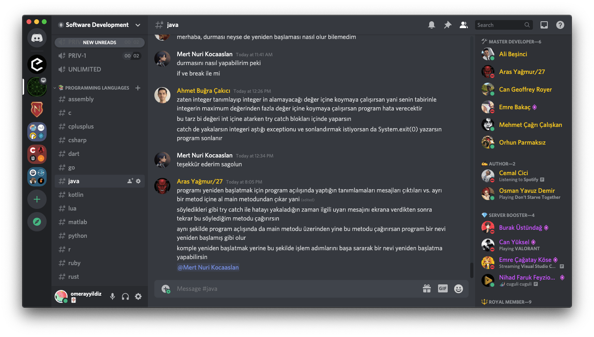

# 🤔 **Doğru Soru**

Sunucu sürekli bir sohbet akışı içindedir. Eğer ilk defa Discord kullanıyor isen sorduğun soru arada kaynayıp gidebilir. Bu yüzden etiket kullanmak seni ilgili kişilere daha hızlı ulaştıracaktır. Etiket yerine "rol veya mention" gibi tanımlamalar da duyabilirsin. 3 tanım da aynı şeyi ifade etmektedir. 

**ÖRNEK 0**
> Arkadaşlar merhaba, şöyle bir sorun yaşamaktayım (...). 
> @Ruby @Visual Studio 

**ÖRNEK 1**
> Bot çalışmıyor, sanırım bir hata olabilir. İlgilenebilir misiniz?
> @🛡️ Moderator 

**NOT:** Lütfen birden fazla etiket atarak üyeleri rahatsız etme. Herhangi bir etiketi bir kere kullanman, ilgili kişiye bildirim gitmesi için yeterlidir. Aksi takdirde mesajların silinir ve moderatörler tarafından uyarılırsın.

Bir rolü etiketledikten sonra eğer cevap alamıyorsan yanlış bir biçimde soruyu sormuş olabilirsin. Üyeler iyi bir üslup ile yazılmayan sorulara cevap vermekten hoşlanmaz. Sana zaman ayırmalarını istiyorsan eğer, lütfen onlara ve zamanlarına saygılı davranmayı dene. Daha önce bir toplulukta bulunmadıysan üzülmene veya çekinmene gerek yok dostum. 

Sana vereceğim bu linkten sunucu içerisinde nasıl soru soracağını daha iyi kavrayabilirsin.

[Bu dökümanı](https://gist.github.com/omerayyildiz/9778c411788535b67c4a5bd816fa7d98) **baştan sona okuman** bu sunucudaki aktiviten için birincil öncelikte önem taşıyor.


Eğer ki İngilizce biliyorsan [bu dökümanı](https://stackoverflow.com/help/how-to-ask) okumanı da şiddetle tavsiye ediyoruz.

Teknik olarak ise çok önemli olan bir nokta var.
Eğer ki kod paylaşacaksan, paylaşacağın kodu aşağıdaki gibi yazman çok önemli, ki discord bunu kod olarak anlasın. 
Böylece paylaşılmış kodu, bize doğru bir şekilde renklendirilmiş ve düzenlenmiş olarak gösterebilsin.

**Örnekler**

````
```c
int main(int argc, char *argv[]) {
    // Stuff..
    exit 0
}
```
````

````
```rust
fn main() {
    println!("hello world");
}
```
````

````
```js
setTimeout(()=>{
    //..
},42);
```
````

Soru sorma biçimi ile ilgili basit bir örneği aşağıda bulabilirsin.

**YANLIŞ ÖRNEK**
> SA RUBY'DEN ANLAYAN VAR MI??????

**DOĞRU ÖRNEK**
Ben Ruby ile bir web uygulaması geliştiriyorum fakat şu şekilde bir hata alıyorum. İnternette araştırdım fakat doğru cevabı bulamadım. Bana yardımcı olabilir misiniz? @Ruby On Rails 

```
Traceback (most recent call last):
        4: from /usr/local/opt/ruby/bin/irb:23:in `<main>'
        3: from /usr/local/opt/ruby/bin/irb:23:in `load'
        2: from /usr/local/Cellar/ruby/2.7.1_2/lib/ruby/gems/2.7.0/gems/irb-1.2.3/exe/irb:11:in `<top (required)>'
        1: from (irb):3
NameError (undefined local variable or method `b' for main:Object)
```
